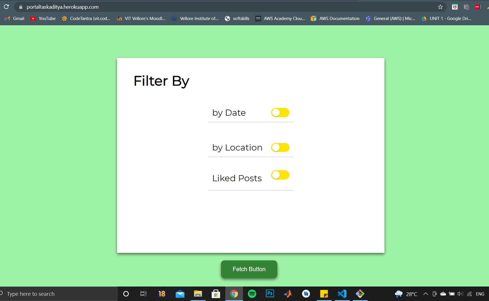
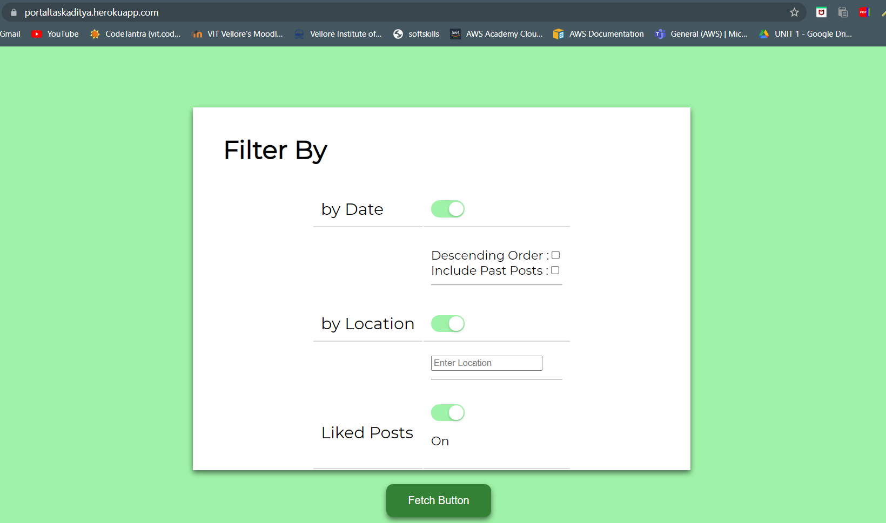
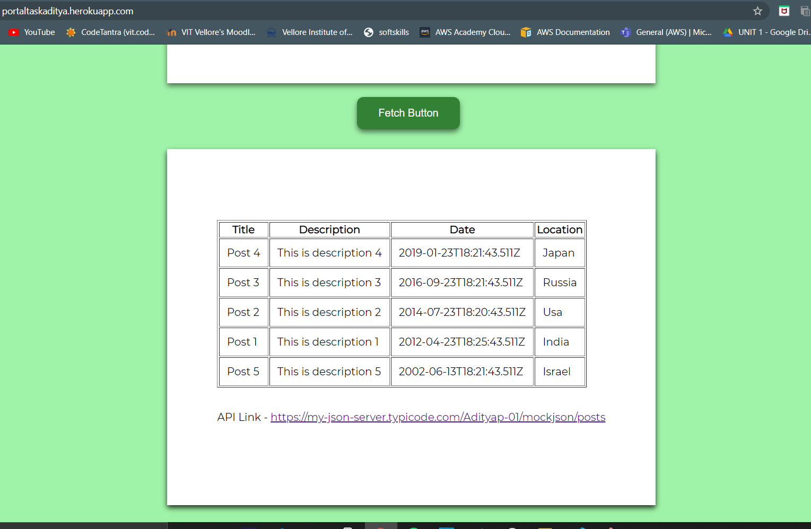

# Filter By 
This is my task for applying at Protal.

## Images - 

## Link -
https://portaltaskaditya.herokuapp.com/

## Use 
1.Click On "Fetch Button" to Make the the Data card Visible.  
2.The first toggle item (by date) displays 2 checkboxes on enabling it.  
3.The second toggle item (by location) display a textbox on enabling it.  

## Uses Fake Api
Link -  https://my-json-server.typicode.com/Adityap-01/mockjson/posts
  The Posts display in Descending Order Of Date. 

